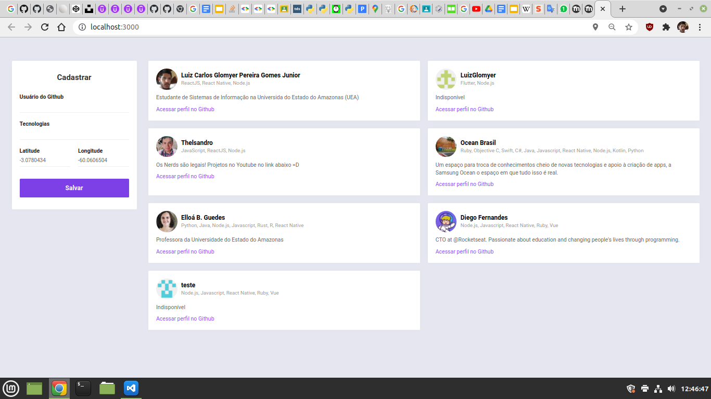

# DevRadar

Tecnologias utilizadas: 

- Backend: Node.js, Expresso, MongoDB
- Frontend: React
- Mobile: React Native, Expo, G
- Libs compartilhadas: Axios, Socket.IO
  
 

> Cadastro em tempo real pela interface web