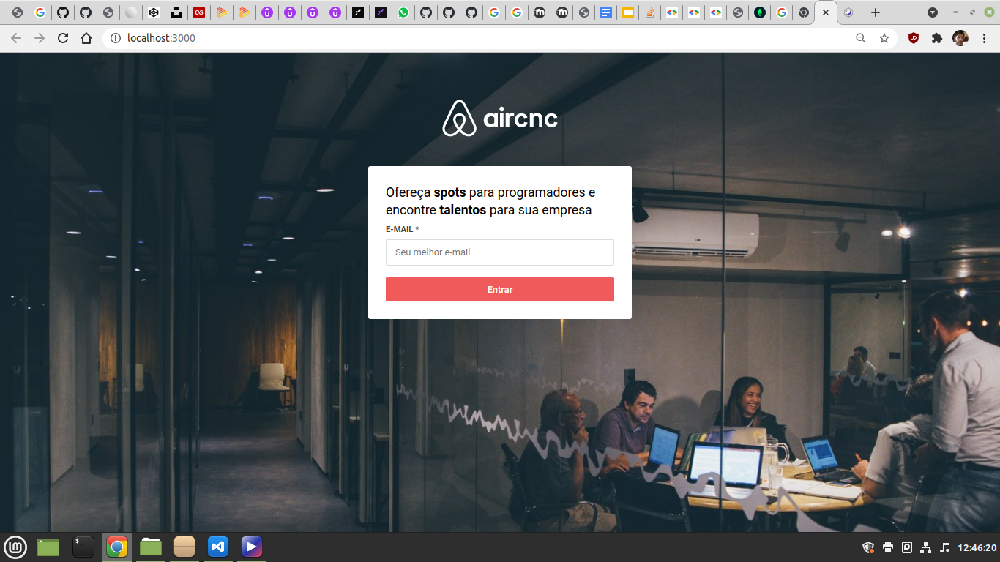
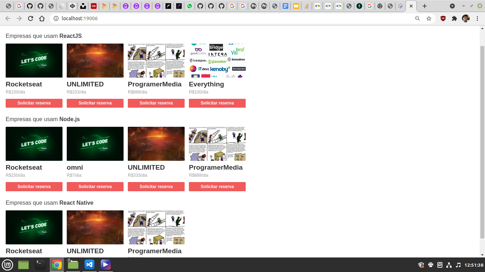
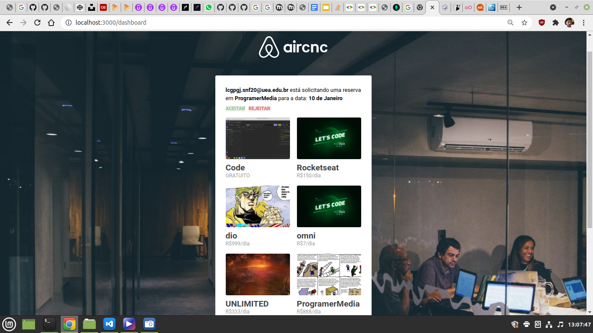

# AirCnC

Tecnologias utilizadas: 

- Backend: Node.js, Expresso, MongoDB
- Frontend: React
- Mobile: React Native, Expo
- Libs compartilhadas: Axios, Socket.IO
  
 

> Login pela interface web

   

> Execução do app mobile no web browser, por meio do Expo

   

> Solicitação de reserva pelo app mobile

   

> Dashboard e comunicação em tempo real por meio de sockets